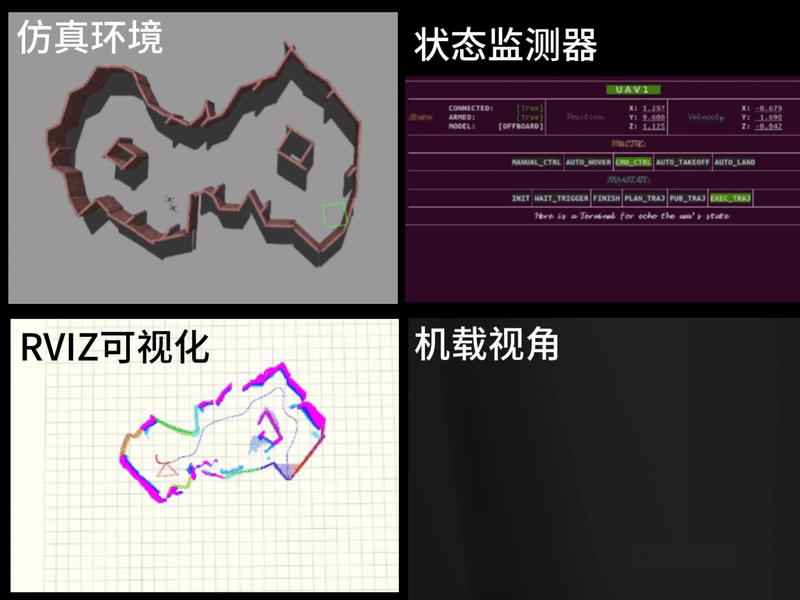

## **Fast-Exploration** 

This document is an extension of [FUEL](https://github.com/HKUST-Aerial-Robotics/FUEL), which is closer to the real experiment through Gazebo simulation. 

## The main updates are: 

1. Added the one-key takeoff function of the [controller](https://github.com/ZJU-FAST-Lab/Fast-Drone-250/tree/master/src/realflight_modules/px4ctrl)
2. Optimized the visual interface

## Achieve results：



And here is the [video](https://www.bilibili.com/video/BV11uknY1EcR/?share_source=copy_web&vd_source=694800f4f1ae99186a15066decbc1bc2)(Bilibili)

## How to use: 
1. Follow this [link](https://www.yuque.com/xtdrone/manual_cn/install_scripts) to install the simulation platform. For details, please refer to this [project](https://github.com/robin-shaun/XTDrone)

2. Start Simulation：

   `roslaunch px4 indoor1.launch`

3. Follow this [link](https://www.yuque.com/xtdrone/manual_cn/pose_groundtruth) to set the location

4. Start planer
   ```
   git clone https://github.com/HNU-CAT/Fast-Exploration.git
   cd Fast-Exploration
   catkin_make # This step requires an internet connection and patience
   ```
   

   ```
   source devel/setup.
   roslaunch exploration_manager rviz.launch # for vis
   ```
   ```
   source devel/setup.
   roslaunch exploration_manager exploration.launch # for plan
   ```

6. Start Controller
   ```
   source devel/setup.
   roslaunch px4ctrl singl_run.launch # for ctrl
   ```

7. Start Monitor

   `roslaunch ftxui_ros single_start.launch`


## Try Real Fly

 1. Change ROS Topic Name in Launch File.

 2. Add [VINS](https://github.com/HKUST-Aerial-Robotics/VINS-Fusion) for location.

 3. Change [Parm](https://github.com/XXLiu-HNU/Fast-Exploration/blob/main/src/realflight_modules/px4ctrl/config/ctrl_param_fpv.yaml) in px4ctrl for your Quadrotor

 4. Something Else Possible ...

## To-Do 24.12.24
1. Single  to Multiple ([Racer](https://github.com/SYSU-STAR/RACER))
2. Remove other uav when mapping  ([Drone detect](https://github.com/ZJU-FAST-Lab/ego-planner-swarm/tree/master/src/planner/drone_detect))
   
## Reference Projects
1. [XTDroen](https://github.com/robin-shaun/XTDrone)   
The simulation platform of the experiment is modified based on this project. Interested readers can refer to the [document](https://www.yuque.com/xtdrone/manual_cn/install_scripts) for reproduction
1. [Fast-Drone-250](https://github.com/ZJU-FAST-Lab/Fast-Drone-250)   
The controller module comes from this project, but this project is only for real objects and a single drone.
1. [FUEL](https://github.com/HKUST-Aerial-Robotics/FUEL)   
The  planning part comes from this project.
